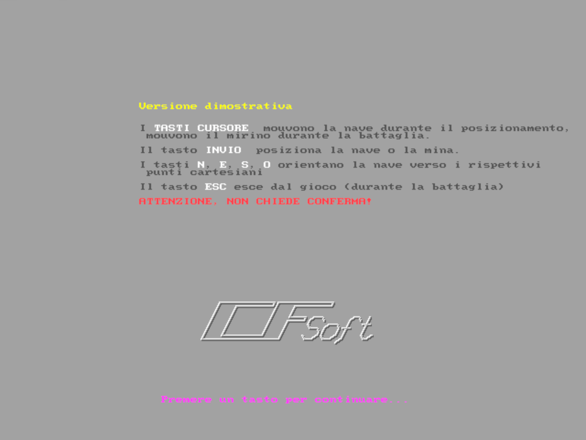
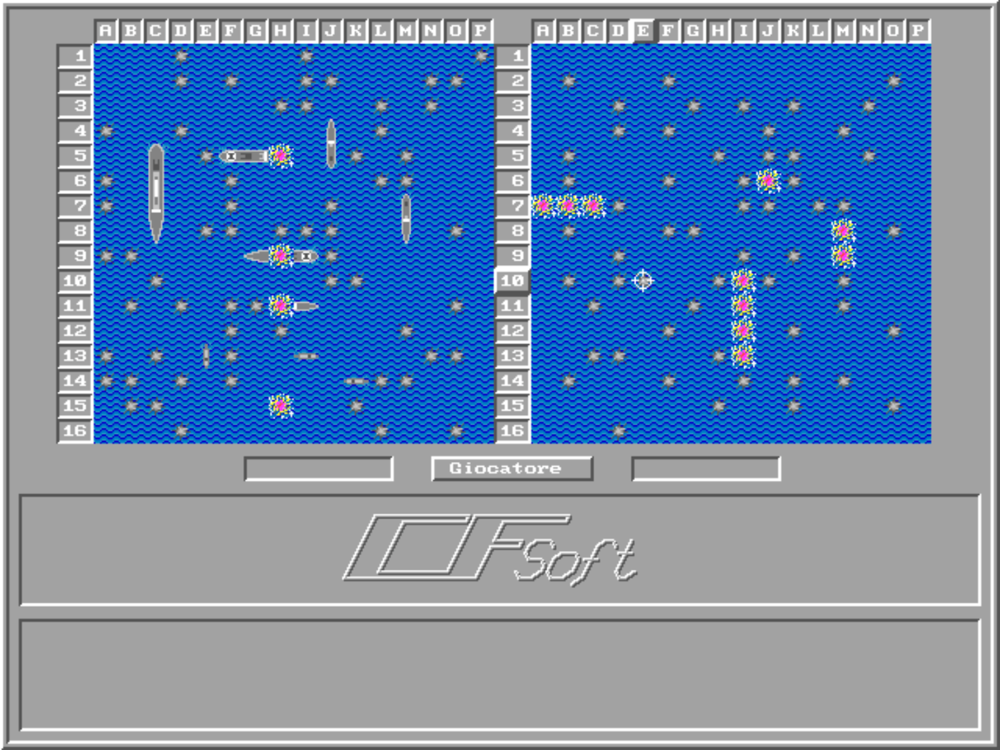

# Battleship (1994)

A small Battleship game I wrote in the first half of 1994.

The game was designed for two PCs connected through RS-232 serial ports, back when networking hardware was not commonly available in school computer labs.

It also included a single-player mode against a very primitive computer opponent, mostly used as a development/testing mode.

## Technical notes

- Ship graphics were originally drawn on an Amiga
- Custom ILBM/IFF parser written to import sprites
- Classic 90s light/shadow UI style
- Point-to-point serial communication experiments
- File timestamps still show 1994

## Screenshots

